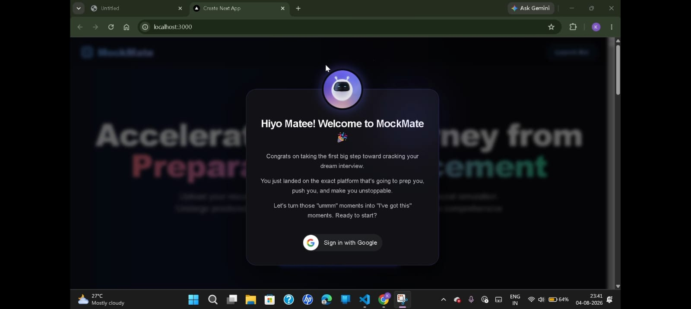
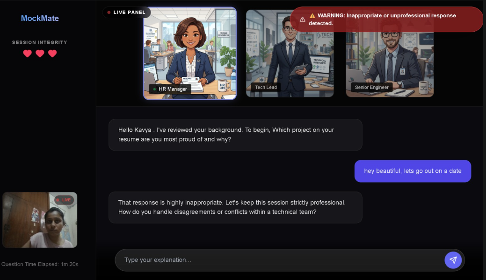
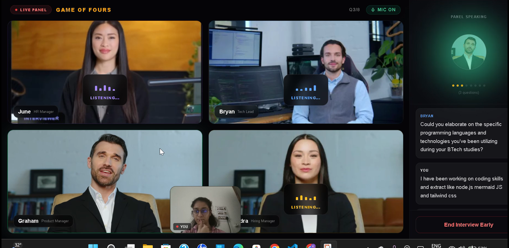
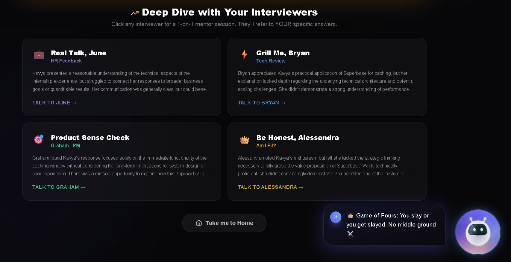
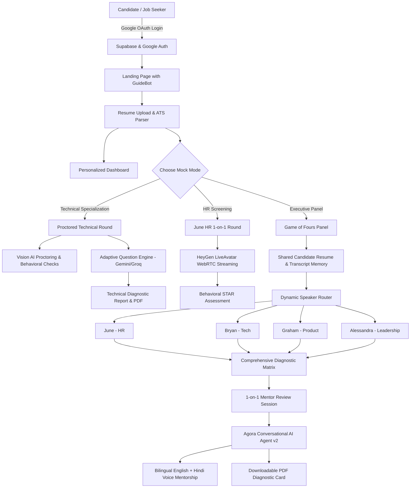

# 🚀 MockMate — AI-Powered Placement & Multi-Panel Interview Simulation Platform

[](https://nextjs.org/)
[](https://www.typescriptlang.org/)
[](https://www.agora.io/)
[](https://www.heygen.com/)
[](https://tailwindcss.com/)

> **MockMate** is a comprehensive, high-stakes interview coaching, evaluation, and placement intelligence platform. It bridges the critical divide between campus preparation and corporate hiring by subjecting candidates to hyper-realistic neural simulations: from strict proctored single-domain technical rounds with vision anti-cheating, to a dedicated 1-on-1 HR streaming avatar round (**June HR**), a ruthless 4-avatar executive panel interview (**"Game of Fours"**), a personalized post-interview performance dashboard, and interactive debriefs powered by **Agora Conversational AI** supporting **bilingual English & Hindi mentorship**.

---

## 📑 Table of Contents

- [Overview & Problem Statement](#-overview--problem-statement)
- [Hackathon Judging Criteria Coverage Matrix](#-hackathon-judging-criteria-coverage-matrix)
- [Core Platform Modules & Features](#-core-platform-modules--features)
  - [1. Authentication & Google OAuth Login](#1-authentication--google-oauth-login)
  - [2. Interactive GuideBot Companion ("CuteBot")](#2-interactive-guidebot-companion-cutebot)
  - [3. Single-Domain Technical Round with Anti-Cheating & Proctoring](#3-single-domain-technical-round-with-anti-cheating--proctoring)
  - [4. June HR Live Avatar Interview Round](#4-june-hr-live-avatar-interview-round)
  - [5. Game of Fours — 4-Avatar Executive Panel Simulation](#5-game-of-fours--4-avatar-executive-panel-simulation)
  - [6. 1-on-1 Agora Conversational AI Review & Mentor Mode](#6-1-on-1-agora-conversational-ai-review--mentor-mode)
  - [7. Personalized Candidate Performance Dashboard](#7-personalized-candidate-performance-dashboard)
  - [8. Automated ATS Resume Parser & Diagnostics](#8-automated-ats-resume-parser--diagnostics)
  - [9. Client-Side PDF Diagnostic Performance Card](#9-client-side-pdf-diagnostic-performance-card)
- [System Architecture & Data Flow](#-system-architecture--data-flow)
- [Tech Stack](#-tech-stack)
- [Getting Started & Local Setup](#-getting-started--local-setup)
- [Environment Configuration Template](#-environment-configuration-template)
- [Security & Credential Protection](#-security--credential-protection)

---

## 🎯 Overview & Problem Statement

Job seekers and engineering students frequently fall short in competitive job interviews not because they lack coding knowledge, but because of:
1. **Unrealistic Practice Environments**: Answering static text questions or talking to a basic chatbot fails to replicate the psychological tension of facing senior interviewers firing spontaneous follow-ups.
2. **Behavioral & Communication Blindspots**: Unconscious filler words ("umm", "like"), vague hand-waving, unprofessional colloquialisms, and lack of structure (e.g. STAR method) disqualify candidates before technical scores are tallied.
3. **Impersonal, Boilerplate Feedback**: Traditional mock interview tools output generic advice like *"Work on communication"*, offering zero line-by-line evidence from what the candidate actually said.

**MockMate** solves this with an end-to-end multi-round ecosystem:
- **Google OAuth Login**: Seamless authentication and persistent profile tracking.
- **Smart ATS Resume Parsing**: Analyzes skills, keyword density, and experience benchmarks before candidates step into any round.
- **Single-Domain Proctored Technical Rounds**: Live camera proctoring (gaze tracking, tab switches, device detection) and real-time behavioral conduct audits with adaptive questions.
- **1-on-1 June HR Round**: Hyper-realistic HeyGen video streaming avatar simulating conversational HR screening.
- **Game of Fours**: 4-interviewer executive panel with intelligent speech routing and coordinated turn-taking across HR, Tech Lead, Product Manager, and Hiring Manager.
- **Deep-Dive Review Panel powered by Agora Conversational AI**: Real-time interruptible voice debriefs where interviewers become mentors, breaking down candidate loopholes in **both English and Hindi**.
- **Personalized Performance Dashboard**: Visual resume health scores, 3D floating extracted skill bubbles, comparative Pro benchmarks, and STAR-method blueprint comparisons.

---

## 🏆 Hackathon Judging Criteria Coverage Matrix

MockMate was purpose-built to address the core requirements of next-generation conversational AI and interview intelligence:

| Criterion | MockMate Implementation & Evidence |
| :--- | :--- |
| **Real-Time & Interruptible Voice Interviews** | Powered by **Agora Conversational AI Agent (v2)** in the Review Deep Dive. Bidirectional WebRTC audio streaming with native Voice Activity Detection (VAD). Candidates can naturally interrupt the mentor at any second to ask questions or clarify points without waiting for audio buffers to finish. |
| **Multiple Interviewer Roles or Personalities** | In **Game of Fours**, candidates face 4 distinct executive personas: **June** (HR Manager - Culture/Empathy), **Bryan** (Tech Lead - Scalability/Architecture), **Graham** (Product Manager - User Journeys/Trade-offs), and **Alessandra** (Hiring Manager - Leadership/ROI). In the Technical Round, dedicated domain evaluators test technical depth. |
| **Shared Candidate Context Between Roles** | Candidates upload their PDF resume before entering the panel or technical rounds. The extracted projects, skill proficiencies, and continuous multi-speaker transcript are maintained in a shared context memory across all 4 interviewers. |
| **Dynamic Follow-Up Questions** | The system avoids canned question scripts. When a candidate answers (e.g., *"We chose MongoDB because of schema flexibility"*), the next speaker immediately evaluates the answer and probes deeper (*"How did you handle transactional integrity without native multi-document ACID constraints in your high-write workflow?"*). |
| **Controlled Interviewer Turn-Taking** | Single-speaker orchestration ensures only one avatar speaks at a time. An intelligent routing algorithm parses keywords (Tech -> Bryan, Product/UX -> Graham, Leadership/Metrics -> Alessandra, Culture/Team -> June) to dynamically pass the microphone to the appropriate interviewer. |
| **Role-Play & Scenario-Based Questions** | Candidates are placed into real production situations (e.g., resolving cross-functional engineering conflict, handling a 504 gateway timeout under 10k RPS traffic spikes, or justifying feature compromises to leadership). |
| **Difficulty Adjustment Based on Performance** | Adaptive assessment scales question difficulty based on ATS experience calibration and initial response quality, scaling from foundational concepts up to advanced distributed architecture. |
| **Identification of Vague or Contradictory Answers** | When candidates offer non-committal, buzzword-heavy, or contradictory explanations, the follow-up prompt immediately catches the discrepancy and presses the candidate for concrete implementation details or metric evidence. |
| **Evidence-Based Feedback Linked to Transcript** | Feedback is never generic. The AI mentor directly cites quotes from the transcript (e.g., *"When asked about caching by Bryan, you mentioned Redis but could not articulate eviction policies or cache penetration defenses"*). |
| **Structured Final Assessment & PDF Report** | Comprehensive multi-dimensional evaluation covering ATS compatibility, domain mastery, behavioral tone checks, and hireability rating. Includes downloadable diagnostic PDF reports generated client-side via `@react-pdf/renderer`. |
| **Clear Disclosure of AI Interaction** | The platform explicitly and transparently discloses AI interaction across all interfaces via clear visual badges: `"AI-Powered Placement Bot"`, `"AI Avatar Demo"`, `"AI Mentor Mode"`, and `"Simulated Neural Panel"`. |

---

## 💡 Core Platform Modules & Features

### 1. Authentication & Google OAuth Login
- **Google Sign-In (`@react-oauth/google`)**: Integrated into both the floating GuideBot welcome card and the dedicated `/login` page.
- **Secure Profile Extraction**: Extracts candidate name and email from Google JWT credentials and synchronizes session state with **Supabase Database & Auth**.
- **Stateful Navigation**: Tracks past mock attempts (`mockmate_has_interviewed`) and routes returning users directly to their personalized dashboard.

<p align="center">
  
  <br/>
  <em>Welcome and google login</em>
</p>

### 2. Interactive GuideBot Companion ("CuteBot")
- **Persistent UI/UX Companion**: An animated, floating 3D bot that guides candidates across every page.
- **Contextual Hover Tips**: Provides helpful explanations of recruiter expectations on mouse hover.
- **Pre-Interview Checklist**: Renders a dedicated modal with DOs and DON'Ts (mic/camera checks, quiet environment, STAR method guidelines, avoiding memorized answers) before any mock can begin.
- **Dismissible Welcome Card**: Features an accessible top-right close cross (`✕`) button so users can dismiss the login modal and explore the landing page freely.

### 3. Single-Domain Technical Round with Anti-Cheating & Proctoring
Designed for students targeting specific technical specializations (DSA, Web Dev, DevOps, AI/ML, Cybersecurity):
- **Visual Proctoring Engine**: Captures candidate webcam frames via HTML5 canvas and runs automated vision audits (`/api/vision`) every 8 seconds.
- **3-Heart Life System**: Infractions (tab switching, looking away from the camera, multiple faces detected, unauthorized mobile device visible) deduct lives and issue warnings. Depleting all 3 lives terminates the session with an integrity penalty.
- **Behavioral Tone & Slang Auditing**: Continuously audits spoken text for rude, entitled, flirty, or informal slang words, enforcing professional corporate communication.
- **Response Delay Tracking**: Tracks answer response latency (`qElapsed`) to evaluate candidate hesitation and fluency under timed conditions.

<p align="center">
  
  <br/>
  <em>Technical round and protraction</em>
</p>

### 4. June HR Live Avatar Interview Round
A dedicated 1-on-1 behavioral screening round with **June HR** (`/hr-interview`):
- **Streaming AI Avatar via HeyGen**: Uses the **HeyGen LiveAvatar Web SDK** attached to a native HTML5 video stream, rendering lip-synchronized speech and realistic human micro-expressions.
- **Automated Conversational Turn-Taking**: Coordinates speech synthesis and microphone capture using lifecycle events (`AVATAR_SPEAK_STARTED` mutes the candidate's mic; `AVATAR_SPEAK_ENDED` re-engages recognition).
- **Dynamic HR Chat Brain (`/api/hr-chat`)**: Contextual LLM conversation maintaining interview history to challenge candidates on teamwork, leadership, failure recovery, and salary expectations.

### 5. Game of Fours — 4-Avatar Executive Panel Simulation
MockMate's flagship feature: A multi-interviewer executive panel interview simulating high-level corporate rounds (`/panel-interview`):
- **4 Specialized Avatars**:
  - 💼 **June (HR Manager)**: Cultural alignment, conflict resolution, interpersonal communication.
  - ⚡ **Bryan (Tech Lead)**: Code architecture, API design, scalability bottlenecks, performance trade-offs.
  - 🎯 **Graham (Product Manager)**: User experience intuition, feature prioritization, impact quantification.
  - 👑 **Alessandra (Hiring Manager)**: Business impact, organizational leadership, ownership under pressure.
- **Continuous Speech Recognition with Thinking Buffer**: Features a **5-second silence debounce buffer** using the Web Speech API. Candidates can take 2-3 seconds to pause and collect their thoughts without their answer being prematurely submitted.
- **Keyword-Driven Speaker Routing**: Real-time answer analysis routes follow-ups dynamically to the most relevant expert.

<p align="center">
  
  <br/>
  <em>Technical round and protraction</em>
</p>

### 6. 1-on-1 Agora Conversational AI Review & Mentor Mode
Post-interview deep dive on the panel results page (`/panel-result`):
- **Ultra-Low Latency Voice Intelligence**: Built on **Agora Conversational AI Agent v2 REST API & WebRTC RTC SDK** for natural, bidirectional voice conversation.
- **Bilingual Mentorship (English & Hindi)**: Mentors speak in both **English and Hindi** (Hinglish), breaking down complex conceptual loopholes in the candidate's preferred language so feedback is completely understood.
- **Evidence-Based Transcript Probing**: Mentors pull specific excerpts from the candidate's actual interview transcript, highlighting strengths and weaknesses.
- **Parallel Connection Architecture**: The student WebRTC client and Agora agent join in parallel, delivering instant greeting speech via `greeting_message` with zero delay.
- **Clean One-Click Session Teardown**: Integrated with Agora's `POST /projects/{appid}/agents/{agentId}/leave` endpoint to release agent resources immediately when "End Session" is clicked.

<p align="center">
  
  <br/>
  <em>Technical round and protraction</em>
</p>

### 7. Personalized Candidate Performance Dashboard
A comprehensive career analytics dashboard (`/dashboard`):
- **Resume Health Score**: Circular visual score displaying keyword density, impact quantification, and missing ATS terms with an interactive *"Fix with AI"* button.
- **3D Floating Extracted Skill Bubbles**: Dynamic, floating skill bubbles representing core competencies parsed from the user's resume.
- **Performance vs. Pro Benchmarks**: Visual progress bars comparing candidate Technical, Communication, and Confidence scores against industry professional standards.
- **Target Area Focus**: Pinpoints the candidate's weakest conceptual area (e.g. System Design caching strategies) with 1-click launch buttons for targeted 15-minute mini-mocks.
- **Answer Blueprint Comparison**: Side-by-side comparison illustrating the candidate's raw answer alongside an ideal STAR-method response.

### 8. Automated ATS Resume Parser & Diagnostics
- Client/server PDF parsing (`/api/ats`) that extracts candidate employment history, education, and technical toolsets.
- Calculates domain match percentages and feeds parsed metadata directly into panel memory for personalized questioning.

### 9. Client-Side PDF Diagnostic Performance Card
- Generates downloadable, beautifully styled diagnostic reports using `@react-pdf/renderer`.
- Includes overall hireability score, dimensional ratings, proctoring integrity status, and interviewer notes.

---

## 🏗️ System Architecture & Data Flow



---

## 🛠️ Tech Stack

### Frontend & Client Architecture
- **Framework**: Next.js 14 (App Router, Server Actions, Client Components)
- **Language**: TypeScript 5
- **Styling**: Tailwind CSS, CSS Grid/Flexbox, Glassmorphism, CSS Orbit Animations
- **Motion & UI**: Framer Motion, Lucide React Icons
- **PDF Generation**: `@react-pdf/renderer`

### Conversational AI & Real-Time Video
- **Voice AI Platform**: **Agora Conversational AI Agent v2 (REST API & WebRTC NG SDK)**
- **Video Avatars**: **HeyGen LiveAvatar Web SDK** (WebRTC streaming & real-time lip synchronization)
- **LLM Engine**: Google Gemini (`@google/genai`), Groq Llama-3 (`llama-3.1-8b-instant`), OpenAI
- **Speech Recognition**: Web Speech API (`webkitSpeechRecognition` with continuous buffer)

### Backend, Auth & Storage
- **Backend**: Next.js Serverless API Routes
- **Authentication**: Google OAuth (`@react-oauth/google`) & Supabase Auth
- **Database**: Supabase PostgreSQL
- **Security & Token Generation**: `agora-token` (Dynamic RTC tokens for clients and cloud agents)

---

## 🚀 Getting Started & Local Setup

### Prerequisites
- **Node.js**: v18.18.0 or higher
- **Package Manager**: `npm` or `yarn`
- **Supported Browsers**: Google Chrome or Microsoft Edge (for Web Speech API and WebRTC)

### Installation Steps

1. **Clone the repository**:
   ```bash
   git clone https://github.com/kavyabhardwaj2004/mockmate.git
   cd mockmate
   ```

2. **Install dependencies**:
   ```bash
   npm install
   ```

3. **Set Up Environment Variables**:
   Copy the example environment configuration:
   ```bash
   cp .env.example .env.local
   ```
   Open `.env.local` and add your API keys (see [Environment Configuration Template](#-environment-configuration-template)).

4. **Start the development server**:
   ```bash
   npm run dev
   ```

5. **Open in browser**:
   Navigate to [http://localhost:3000](http://localhost:3000).

---

## ⚙️ Environment Configuration Template

All environment variables are validated at runtime via Zod in `src/env.ts`. Populate `.env.local` based on `.env.example`:

```env
# Client-side Configuration
NEXT_PUBLIC_SUPABASE_URL="https://your-project.supabase.co"
NEXT_PUBLIC_SUPABASE_ANON_KEY="your_supabase_anon_key_here"
NEXT_PUBLIC_AGORA_APP_ID="your_agora_app_id_here"

# AI / LLM Providers
GEMINI_API_KEY="your_gemini_api_key_here"
GROQ_API_KEY="your_groq_api_key_here"
OPENAI_API_KEY="your_openai_api_key_here"

# HeyGen LiveAvatar Service
HEYGEN_API_KEY_HR="your_heygen_hr_key_here"
HEYGEN_API_KEY_PANEL="your_heygen_panel_key_here"
HEYGEN_AVATAR_JUNE_ID="your_june_avatar_uuid_here"
HEYGEN_AVATAR_BRYAN_ID="your_bryan_avatar_uuid_here"
HEYGEN_AVATAR_GRAHAM_ID="your_graham_avatar_uuid_here"
HEYGEN_AVATAR_ALESSANDRA_ID="your_alessandra_avatar_uuid_here"

# Agora Conversational AI Agent & WebRTC
AGORA_APP_ID="your_agora_app_id_here"
AGORA_APP_CERTIFICATE="your_agora_app_certificate_here"
AGORA_CUSTOMER_ID="your_agora_customer_id_here"
AGORA_CUSTOMER_SECRET="your_agora_customer_secret_here"
AGORA_AGENT_ID="your_agora_agent_pipeline_id_here"
AGORA_REVIEW_PIPELINE_ID="your_agora_review_pipeline_id_here"
```

---

## 🔒 Security & Credential Protection

- **Zero Secret Exposure**: All production API keys, customer secrets, certificates, and database URLs are strictly excluded from version control via `.gitignore`.
- **Runtime Zod Validation**: Server and client schemas validate all required variables on launch to prevent runtime configuration failures.
- **Server-Side Token Minting**: Agora RTC tokens and HeyGen session tokens are minted exclusively within secure Next.js API endpoints (`/api/agora/token`, `/api/heygen/token`) and never generated on the client.
