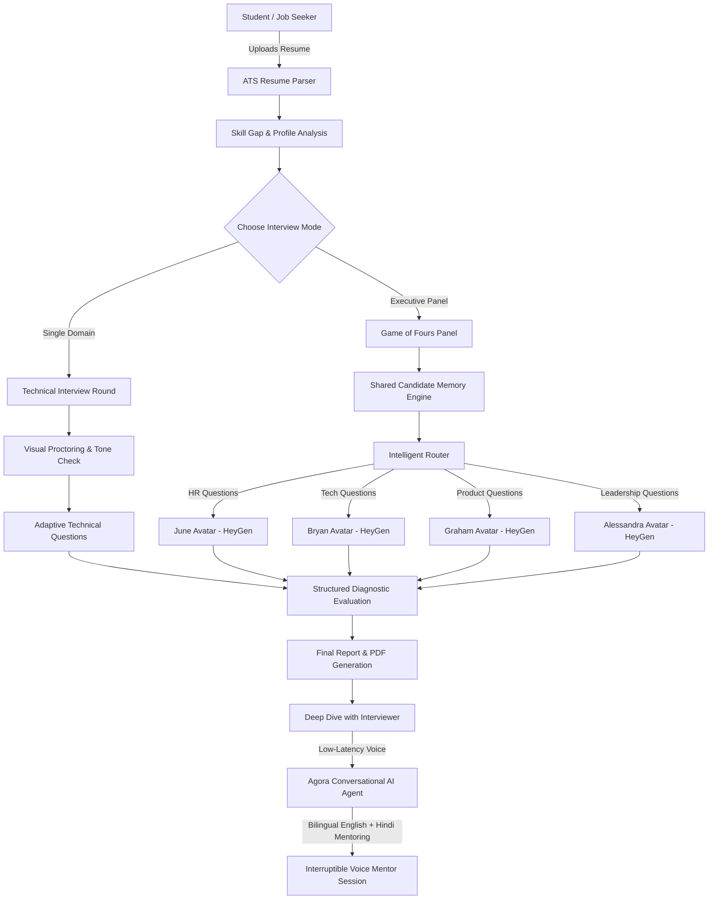

# 🚀 MockMate — AI-Powered Placement & Multi-Panel Interview Simulation Platform

[](https://nextjs.org/)
[](https://www.typescriptlang.org/)
[](https://www.agora.io/)
[](https://www.heygen.com/)
[](https://tailwindcss.com/)

> **MockMate** is an intelligent, high-stakes interview coaching and evaluation platform. It bridges the gap between campus preparation and corporate placement by subjecting candidates to hyper-realistic neural simulations—ranging from strict proctored single-domain technical rounds to a ruthless 4-avatar executive panel interview (**"Game of Fours"**) and real-time interactive mentor debriefs powered by **Agora Conversational AI**.

---

## 📑 Table of Contents

- [Overview & Problem Statement](#-overview--problem-statement)
- [Hackathon Judging Criteria Coverage](#-hackathon-judging-criteria-coverage)
- [Key Architectural Highlights & Core Rounds](#-key-architectural-highlights--core-rounds)
  - [1. Technical Round for Students](#1-technical-round-for-students)
  - [2. Game of Fours — 4-Avatar Executive Panel](#2-game-of-fours--4-avatar-executive-panel)
  - [3. 1-on-1 Agora Conversational AI Mentor Review](#3-1-on-1-agora-conversational-ai-mentor-review)
  - [4. GuideBot — Interactive UI/UX Placement Companion](#4-guidebot--interactive-uiux-placement-companion)
- [System Architecture & Flow](#-system-architecture--flow)
- [Tech Stack](#-tech-stack)
- [Getting Started & Local Setup](#-getting-started--local-setup)
- [Environment Configuration](#-environment-configuration)
- [Security & Credential Protection](#-security--credential-protection)

---

## 🎯 Overview & Problem Statement

Job seekers and engineering graduates frequently fail interviews not because they lack coding knowledge, but because of:
1. **Unrealistic Practice**: Answering static text prompts is nothing like facing multiple senior interviewers firing spontaneous follow-ups.
2. **Behavioral Blindspots**: Unconscious filler words ("umm", "like"), vague answers, casual slang, and defensive body language disqualify candidates before technical scoring is even tallied.
3. **Generic Feedback**: Standard mock tools output boilerplate advice like *"Work on communication"*, offering zero line-by-line evidence from what the candidate actually said.

**MockMate** solves this with a multi-tier simulation pipeline:
1. **The Technical Candidate Round**: An intensive, proctored session with ATS resume parsing, behavioral integrity detection, dynamic follow-ups, and adaptive difficulty.
2. **Game of Fours**: A multi-interviewer executive panel simulation (HR, Tech Lead, Product Manager, Hiring Manager) using **HeyGen LiveAvatar** video lip-sync and **Agora Conversational AI** voice intelligence.
3. **Personalized 1-on-1 Deep-Dive Review**: Post-interview mentor debriefs where candidates can talk freely in **both English and Hindi** to probe their loopholes.

---

## 🏆 Hackathon Judging Criteria Coverage

MockMate was purpose-built to address the core requirements of next-generation conversational AI and interview intelligence:

| Criterion | MockMate Implementation |
| :--- | :--- |
| **Real-time & Interruptible Voice Interviews** | Powered by **Agora Conversational AI Agent (v2)** in the Review Deep Dive. Supports bidirectional low-latency WebRTC voice streaming with native Voice Activity Detection (VAD). The candidate can interrupt the mentor naturally at any moment. |
| **Multiple Interviewer Roles & Personalities** | In **Game of Fours**, candidates face 4 distinct executive personas: **June** (HR & Culture), **Bryan** (Tech Lead & Code Architecture), **Graham** (Product Manager & UX), and **Alessandra** (Hiring Manager & Leadership/ROI). In the Technical Round, specialized domain interviewers evaluate technical depth. |
| **Shared Candidate Context Between Roles** | The student's uploaded PDF resume is parsed by our ATS engine before rounds start. Candidate project stack, experience, and running transcript are passed into the prompt memory shared across all 4 panel interviewers. |
| **Dynamic Follow-Up Questions** | Answers are evaluated in real time. If a candidate mentions an architecture decision (e.g., *"We switched from REST to WebSockets"*), the system dynamically probes the technical justification rather than reading fixed question lists. |
| **Controlled Interviewer Turn-Taking** | Single-speaker orchestration guarantees only one avatar speaks at a time. The panel orchestrator routes each answer to the most relevant expert based on candidate keywords (Tech -> Bryan, UX -> Graham, Metrics -> Alessandra, Team -> June). |
| **Role-Play & Scenario-Based Questions** | Candidates are placed into real-world production incidents (e.g., race conditions under 10k RPS, balancing technical debt vs. feature release timelines, and cross-functional conflict). |
| **Difficulty Adjustment Based on Performance** | Adaptive evaluation scales question difficulty from standard foundational checks up to advanced distributed systems design based on answer quality and ATS alignment. |
| **Identification of Vague or Contradictory Answers** | When candidates provide buzzword-heavy or contradictory answers, the system identifies the gap and triggers an immediate follow-up demanding concrete proof or clarifying trade-offs. |
| **Evidence-Based Feedback Linked to Transcript** | Feedback is never generic. Mentor AI references exact quotes from the transcript (e.g., *"When asked about caching, you mentioned Redis but couldn't explain invalidation strategies"*). |
| **Structured Final Assessment & PDF Report** | Comprehensive end-of-interview report featuring overall scores, ATS hireability profile, domain-by-domain breakdowns, strengths, weaknesses, and a downloadable PDF diagnostic card generated via `@react-pdf/renderer`. |
| **Clear Disclosure of AI Interaction** | Transparent badges and indicators throughout the interface (`"AI-Powered Placement Bot"`, `"Streaming AI Avatar"`, `"AI Mentor Mode"`) ensure the user is always informed of the AI interaction. |

---

## 💡 Key Architectural Highlights & Core Rounds

### 1. Technical Round for Students
Designed specifically for university students and early-career software engineers:
- **Smart ATS Resume Parser**: Extracts PDF resumes, analyzes keyword density, calculates domain alignment, and flags skill gaps against industry benchmarks.
- **Visual Proctoring & Identity Verification**: Verifies candidate camera feed and monitors focus, tab switching, and gaze discipline to simulate genuine proctored examinations.
- **Behavioral Conduct & Tone Auditing**: Detects slang, filler words, casual colloquialisms, rude remarks, and unprofessional tones in real-time. Gives actionable warnings and enforces corporate decorum.
- **Gamified Live Interview Experience**: Interactive stopwatch timers, real-time feedback loops, and dynamic question progression across Data Structures, Web Development, DevOps, and System Design.

### 2. Game of Fours — 4-Avatar Executive Panel
The flagship simulation for both university graduates and experienced job seekers:
- **4 Dedicated LiveAvatars**:
  - 💼 **June (HR Manager)**: Probes cultural fit, teamwork, conflict resolution, and behavioral alignment.
  - ⚡ **Bryan (Tech Lead)**: Drills down on system architecture, database choices, scalability, and code trade-offs.
  - 🎯 **Graham (Product Manager)**: Challenges product sense, user experience intuition, prioritization, and edge-case testing.
  - 👑 **Alessandra (Hiring Manager)**: Evaluates business impact, ownership, leadership under fire, and ROI.
- **HeyGen LiveAvatar WebRTC Streaming**: Avatars feature real-time video rendering with realistic human micro-expressions and synchronized lip movement.
- **Intelligent Speech Endpointing**: Continuous speech recognition featuring a 5-second thinking buffer so candidates can pause and collect their thoughts without premature auto-submission.

### 3. 1-on-1 Agora Conversational AI Mentor Review
Post-panel deep dive that transitions interviewers from evaluators into personal career mentors:
- **Real-Time WebRTC Voice**: Powered by **Agora Conversational AI Agent v2**, connecting candidates directly to an AI mentor room via low-latency audio.
- **Bilingual Mentorship (English & Hindi)**: Mentors can explain complex technical shortcomings in both **English and Hindi** (Hinglish supported), ensuring Indian candidates from diverse linguistic backgrounds completely grasp their feedback.
- **Evidence-Based Guidance**: Mentors pull specific candidate responses directly from the interview transcript to explain what was good, what was missing, and how to answer better next time.
- **Interruptible & Responsive**: Natural voice activity detection allows candidates to speak up, ask clarifying questions, and debate points with the mentor in real time.
- **Clean Session Termination**: Integrated with Agora's `POST /agents/{agentId}/leave` API to instantly release resources when the candidate clicks *"End Session"*.

### 4. GuideBot — Interactive UI/UX Placement Companion
- Floating interactive placement guide ("CuteBot") that accompanies candidates across the platform.
- Provides dynamic contextual tips on hover, explains recruiter evaluation rubrics, displays pre-interview DOs & DON'Ts checklists, and offers seamless dismissal via a top-right close control.

---

## 🏗️ System Architecture & Flow



---

## 🛠️ Tech Stack

### Frontend & UI
- **Framework**: Next.js 14 (App Router, Server Components & Client Hooks)
- **Language**: TypeScript 5
- **Styling**: Tailwind CSS, Custom Glassmorphism, CSS Orbit Animations
- **Animations**: Framer Motion
- **Icons**: Lucide React
- **Document Generation**: `@react-pdf/renderer` (Generates custom diagnostic reports client-side)

### Conversational AI & Video Avatars
- **Voice Intelligence**: **Agora Conversational AI Agent (v2 REST API & RTC WebRTC SDK)**
- **Video Avatars**: **HeyGen LiveAvatar Web SDK** (Real-time avatar streaming & lip-syncing)
- **Large Language Models**: Google Gemini (`@google/genai`), Groq Llama-3 (`llama-3.1-8b-instant`), OpenAI

### Backend & Storage
- **Runtime**: Next.js Serverless API Routes
- **Database & Auth**: Supabase (PostgreSQL, Row-Level Security, Auth Tokens)
- **Token Builders**: `agora-token` (Dynamic RTC Token generation for users and agents)
- **Speech Recognition**: Web Speech API (`webkitSpeechRecognition` with continuous debounce)

---

## 🚀 Getting Started & Local Setup

### Prerequisites
- **Node.js**: v18.18.0 or higher
- **Package Manager**: `npm` or `yarn`

### Installation Steps

1. **Clone the repository**:
   ```bash
   git clone https://github.com/kavyabhardwaj2004/mockmate.git
   cd mockmate
   ```

2. **Install dependencies**:
   ```bash
   npm install
   ```

3. **Configure Environment Variables**:
   Copy the example environment template:
   ```bash
   cp .env.example .env.local
   ```
   Open `.env.local` and insert your API credentials (refer to the [Environment Configuration](#-environment-configuration) section below).

4. **Run the development server**:
   ```bash
   npm run dev
   ```

5. **Open the application**:
   Navigate to [http://localhost:3000](http://localhost:3000) in Google Chrome or Microsoft Edge.

---

## ⚙️ Environment Configuration

All environment variables are validated at build time via Zod in `src/env.ts`. Populate `.env.local` using the template below:

```env
# Client-side Configuration
NEXT_PUBLIC_SUPABASE_URL="https://your-project.supabase.co"
NEXT_PUBLIC_SUPABASE_ANON_KEY="your_supabase_anon_key_here"
NEXT_PUBLIC_AGORA_APP_ID="your_agora_app_id_here"

# AI / LLM Providers
GEMINI_API_KEY="your_gemini_api_key_here"
GROQ_API_KEY="your_groq_api_key_here"
OPENAI_API_KEY="your_openai_api_key_here"

# HeyGen LiveAvatar Service
HEYGEN_API_KEY_HR="your_heygen_hr_key_here"
HEYGEN_API_KEY_PANEL="your_heygen_panel_key_here"
HEYGEN_AVATAR_JUNE_ID="your_june_avatar_uuid_here"
HEYGEN_AVATAR_BRYAN_ID="your_bryan_avatar_uuid_here"
HEYGEN_AVATAR_GRAHAM_ID="your_graham_avatar_uuid_here"
HEYGEN_AVATAR_ALESSANDRA_ID="your_alessandra_avatar_uuid_here"

# Agora Conversational AI Agent & WebRTC
AGORA_APP_ID="your_agora_app_id_here"
AGORA_APP_CERTIFICATE="your_agora_app_certificate_here"
AGORA_CUSTOMER_ID="your_agora_customer_id_here"
AGORA_CUSTOMER_SECRET="your_agora_customer_secret_here"
AGORA_AGENT_ID="your_agora_agent_pipeline_id_here"
AGORA_REVIEW_PIPELINE_ID="your_agora_review_pipeline_id_here"
```

---

## 🔒 Security & Credential Protection

- **Zero Secret Exposure**: All production API keys, customer secrets, certificates, and database URLs are strictly excluded from version control via `.gitignore`.
- **Runtime Environment Parsing**: All environment variables are validated through Zod schema validation in `src/env.ts` to prevent missing configuration errors in production.
- **Client/Server Isolation**: Sensitive credentials (Agora Customer Secret, App Certificate, HeyGen API Keys) are strictly executed within Next.js server-side API routes and never bundled into client-side code.
